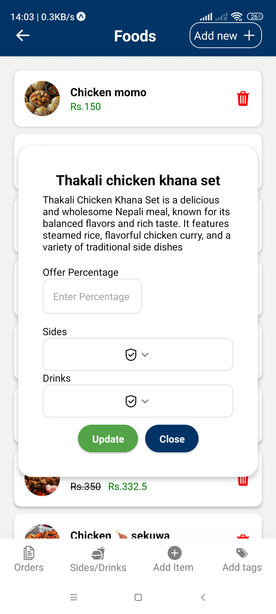

# Foodie React Native App

## 📌 Project Overview
Foodie is a **MERN stack** (MongoDB, Express, React Native, Node.js) mobile application for food ordering. It allows users to browse menus, place orders, and manage their accounts.

## 🛠 Tech Stack
- **Frontend:** React Native, Expo
- **Backend:** Node.js, Express, MongoDB
- **Authentication:** JWT, Twilio (for OTP verification)
- **Networking:** Axios


## Customer Side

<div>
  
  
  
  
  
  
</div>

## Owner Side

<div>
  
  
  
  
  
</div>

## 🚀 Installation & Setup
### **1️⃣ Clone the Repository**
```sh
git clone https://github.com/your-username/foodie-react-native.git
cd foodie-react-native-main
```

### **2️⃣ Backend Setup**
1. Navigate to the backend folder:
   ```sh
   cd backend
   ```
2. Install dependencies:
   ```sh
   npm install
   ```
3. Configure `.env` file (create one if missing):
   ```ini
   MONGO_URI=your_mongodb_connection_string
   JWT_SECRET=your_jwt_secret
   TWILIO_ACCOUNT_SID=your_twilio_sid
   TWILIO_AUTH_TOKEN=your_twilio_auth_token
   ```
4. Start the backend server:
   ```sh
   node index.js
   ```

### **3️⃣ Frontend Setup**
1. Navigate to the frontend folder:
   ```sh
   cd ../frontend
   ```
2. Install dependencies:
   ```sh
   npm install
   ```
3. Update `BASE_URL` in API service files to point to your backend (Cloudflare Tunnel recommended).
4. Start the app:
   ```sh
   npx expo start
   ```

---

## 🛠 Troubleshooting
- **Cannot connect to backend?** Run `cloudflared tunnel --url http://localhost:5000` and use the provided URL in your frontend.
- **Expo font errors?** Ensure fonts are loaded before usage.
- **Headers already sent error?** Check if multiple responses are being sent in Express routes.

---

## 📌 Features
✅ User Authentication (JWT + OTP)  
✅ Food Ordering System  
✅ Secure API Communication  
✅ Responsive UI & Smooth Navigation  

---

## 📜 License
This project is **open-source** and available under the MIT License.

---

## 🤝 Contributing
Feel free to fork, submit issues, or create pull requests! 🎉


